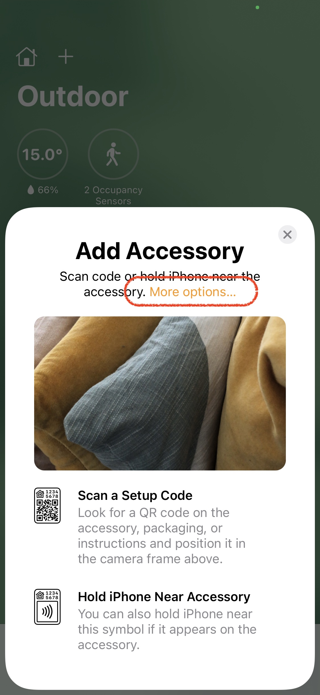
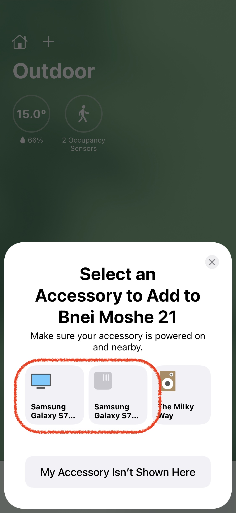

<p align="center">


</p>

# Homebridge ADB

Not so simple homebridge plugin to control remote ADB enabled Android device. The idea is to make random Android based TV box can be controlled with Home App. It make any Android device appear as TV accesory. Where you can control on/off status, volume and dpad control via Control Center remote, and launch certain predefined app defined in the configuration.

This plugins register it self as external accesorries. Make sure after adding Homebridge bridge in Home App, manually "add accesories" to add the android device in the Home App.

|||||
|----------|----------|----------|----------|

## Prerequisite

* Install Homebridge, Homebridge Config UI X (this plugin support web configuration over there), and this plugins
	```
	sudo npm install -g --unsafe-perm homebridge homebridge-adb
	```

* Install ADB tools inside Homebridge server. Open Homebridge Config UI X in your browser then navigate to terminal, and then run this command:
	* If the homebridge server is inside Ubuntu, use this command:
		```
		sudo apt-get install android-tools-adb android-tools-fastboot
		```
	*  Or, if the homebridge is inside Docker container like the one from of oznu/docker-homebridge, please refer to **Docker container** section
	*  Or, if you're using other OS, please refer this link to download the ADB tools: [https://developer.android.com/studio/releases/platform-tools](https://developer.android.com/studio/releases/platform-tools)
	*  To check if the ADB installed properly, run this command:
		```
		adb version
		```
		This will output something like `Android Debug Bridge version x.x.x`

* Enable Developer mode in your Android device, visit this documentation for more information [https://developer.android.com/studio/debug/dev-options](https://developer.android.com/studio/debug/dev-options)

* **IMPORTANT**: Some Android device doesn't have support remote ADB by default. If your device is one of them, connect your device with USB cable to any computer with ADB installed. Open terminal and run this command:
	```
	adb tcpip 5555
	```
	if no error produced, disconnect unplug the USB cable from the computer.

* _Optionally_, run this command to make sure you can connect to device:
	```
	adb connect your-device-ip
	```
	If all goes well, there will be a popup window in your android device asking for debug permission. After you accept the request, you might want to do kill the adb server to make a fresh connection
	```
	adb kill-server
	```
	After that reconnect your device again with previous adb connect. And after that, you should able to run this command
	```
	adb -s your-device-ip shell "getprop ro.product.model"
	```
	and get it will output your device model.

### Docker container based on [oznu/docker-homebridge](https://github.com/oznu/docker-homebridge)

*  (Mandatory) If you're using a container based on Alpine Linux (like `oznu/docker-homebridge:latest`), run this command in terminal to install adb
	```shell
	# Install adb, required by the homebridge-adb plugin
	apk --update-cache --repository http://dl-cdn.alpinelinux.org/alpine/v3.14/community/ add android-tools
	```
	You can use other version of repo, but I only tested the v3.14 repo, and it seems it's the only adb tools that work with oznu/docker-homebridge .

* (Mandatory) If you're using a container based on Debian (like the `oznu/docker-homebridge:ubuntu` & `oznu/docker-homebridge:debian` docker image), run this command in terminal to install adb
	```shell
	# Update apt package index
	apt-get update

	# Install adb, required by the homebridge-adb plugin
	apt-get install -y android-tools-adb android-tools-fastboot
	```

*  (Optional) Append the followings line to your `config/startup.sh` to install this plugin on every container restart:
	```shell
	# Install the homebridge-adb plugin
	npm install homebridge-adb
	```
	
* (Optional) If you run into issues when connecting your android device (sometimes adb can't create the `$HOME/.android/adbkey`), add this line to your `config/startup.sh`:
	```shell
	# Fix connection issues for the homebridge-adb plugin
	adb connect $YOUR_ANDROID_DEVICE_IP
	```


## Configuration

Here an example of configuration that you can use. If you're using Homebridge Config UI X, you can configure your device there, but there's a small hiccup with Inputs. It only display one input, but if you press add, it will display the rest of the inputs.

    "platforms": [
        {
            "platform": "HomebridgeADB",
            "accessories": [
                {
                    "name": "NVIDIA Shield",
                    "interval": 1000,
                    "ip": "192.168.1.136",
                    "mac": "97:b6:e8:46:9f:cb",
					"timeout": 1000,
                    "playbacksensor": true,
                    "playpauseobutton": "KEYCODE_MEDIA_PLAY_PAUSE",
                    "backbutton": "KEYCODE_BACK",
                    "infobutton": "KEYCODE_HOME",
                    "category": "TV_STREAMING_STICK",
                    "hidenumber": true,
                    "hidehome": true,
                    "hideother": true,
                    "debug": true,
                    "skipSpeaker": false,
                    "inputs": [
                        {
                            "name": "HBO Now",
                            "id": "com.hbo.hbonow"
                        },
                        {
                            "name": "Apple Music",
                            "id": "com.apple.android.music"
                        }
                    ]
                },
                {
                    "name": "Meizu",
                    "ip": "192.168.1.121",
                    "playbacksensor": false,
                    "poweron": "KEYCODE_POWER",
                    "inputs": [
                        {
                            "name": "Termux",
                            "id": "com.termux",
                            "adb": "monkey -p com.termux 1"
                        },
                        {
                            "name": "Apple Music",
                            "id": "com.apple.android.music"
                        }
                    ]
                }
            ]
        }
    ]

* **platform** (mandatory): the name of this plugin.
* **name** (mandatory): the name of the device.
* **ip** (mandatory): the IP address of the device.
* *mac* (optional): the MAC address of the device. When provided abd your device support Wake On LAN, this plugin will try to use WOL to wake up your device. Useful if your device disconnect ADB connection after it turned off.
* *inputs* (optional): by default the plugins will create Home for launcher shortcut and Other for previous app shortcut as input. If set, the plugins will add more input based on the config. To know your app id, please see your Homebridge log. When you leave this blank, and set *hidehhome* and *hideother* to true, the plugins will hide inputs in Home App.
	* *name* (mandatory): the name of the input.
	* *id* (mandatory): the application id. The id will be use for input switcher in Home app. If you put random id, the input will move to "other".
	* *adb* (optional): you can run your own ADB shell command here, such as: `monkey -p com.app.id 1`. This is an ADB shell command, so you doesn't need to type "adb -s ipaddress shell ...".
* *interval* (optional): if not set, the plugin will check device statuses every 5000 miliseconds.
* *timeout* (optional): if not set, the plugin will limit ADB execution timeout to 1000 miliseconds.
* *playbacksensor* (optional): if set to *true*, plugin will create a motion sensor based on playback activity (either video or music).
* *category* (optional): you can choose from this categories: *APPLE_TV, TELEVISION, TV_STREAMING_STICK, TV_SET_TOP_BOX, AUDIO_RECEIVER, or SPEAKER*. Home app will display different icon based on the category you choose.
* *infobutton*, *playpauseobutton*, *backbutton* (optional): assign custom key event code for Remote control in iOS Control Center, see [https://developer.android.com/reference/android/view/KeyEvent](https://developer.android.com/reference/android/view/KeyEvent) for the key codes.
* *hidenumber* (optional): if set to *true*, plugin will hide number inputs in Home App.
* *hidehome* (optional): if set to *true*, plugin will hide "Home" input in Home App.
* *hideother* (optional): if set to *true*, plugin will hide "Other" input in Home App.
* *debug* (optional): if set to *true*, plugin will output more debug info in homebridge log.
* *skipSpeaker* (optional): if set to *true*, an accompanying speaker will not be initialized for the device and will disable volume control in Control Center Remote.
* *poweron*, *poweroff* (optional): assign csutom key event code for Power on/off, you can use KEYCODE_POWER or combination of KEYCODE_AWAKE/KEYCODE_SLEEP. See [https://developer.android.com/reference/android/view/KeyEvent](https://developer.android.com/reference/android/view/KeyEvent) for the other key codes that might more suitable for your device.


### **GOOD TO KNOW**: ADB commands that this plugin use

* Device name
	```
	adb -s your-device-ip shell "getprop ro.product.manufacturer"
	```
* Device model
	```
	adb -s your-device-ip shell "getprop ro.product.model"
	```
* Device serial number
	```
	adb -s your-device-ip "getprop ro.serialno"
	```
* To run "keyboard" command like up, down, sleep, awake, volume control, etc
	```
	adb -s your-device-ip shell "input keyevent KEYCODE"
	```
* To know device sleep status based on whether secreen is turned on or off
	```
	adb -s your-device-ip shell 'dumpsys power | grep mHoldingDisplay | cut -d = -f 2'
	```
* Running an app using their package name
	```
	adb -s your-device-ip shell "monkey -p package.name 1"
	```
* To know current on screen app

	New:
	```
	adb -s your-device-ip shell "dumpsys activity activities | grep ' ResumedActivity'"
	```
	Old:
	```
	adb -s your-device-ip shell "dumpsys window windows | grep -E mFocusedApp"
	```


## FAQ

* My playback sensor doesnt seem to working after updating to 1.4.3 from 1.4.x
	* Remove your playback sensor and the readd it again in Home app, it seems like the new code causing Homekit to unrecognized it.
* My device is not responding after updating to 1.4.*
	* Due additional new features of playback sensor, HomeKit is unable to recognize the old accessory due to different characteristics. To fix this, you need to remove your accesory from Home app, then rename you device in config.json, and restart Homebridhe. This will create a new accesories that you can re-add again in home app. When you add them, be sure to rename your new accessory the same as to the old one in Home app if posible, this hopefully will retain your automations.
* Where can I use volume and D-Pad control for my device?
	* First turn on "Apple TV Remote" control from your iOS device inside Settings -> Control Center. Then swipe down Control Center, you'll see a remote icon. Tap the remote icon to open the remote, you can use your iOS device screen for the D-Pad, and use your iOS device physical volume button to control your device volume.
* Why I can't turn on my device after turning it off?
	* Your device might disconnected from network connection after you turn off your device. You need to turn it on manually. Or, please make sure your device still able to recieve network connection when it turned off, check your device settings for it.
* Is this safe?
	* Actually I don't know, it feels very dirty (I need to wash my hand everytime I use this) and hacky, but it works for me.
* I found some bugs, what should I do?
	* You can submit your bugs here [https://github.com/dwaan/homebridge-adb/issues](https://github.com/dwaan/homebridge-adb/issues) or you can help me to fix it by sending pull request.
* Can this plugins do (insert stuff you want to do to your device)?
	* I think so, ADB can basically control your device remotely. If you have other idea for what this can do, you can submit your idea as an issue.
* Can I buy you a beer?
	* No, [but you can buy me an Ice cream](https://www.buymeacoffee.com/dwaan). But if you like this plugins feel free to stared this repo.
